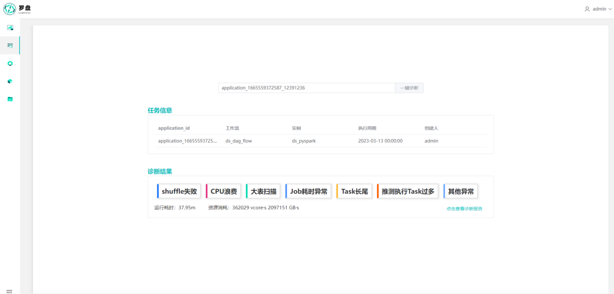

# Compass

[中文文档](README_zh.md)

Compass is a big data task diagnosis platform, which aims to improve the efficiency of user troubleshooting and reduce
the cost of abnormal tasks for users.

The key features:

- Non-invasive, instant diagnosis, you can experience the diagnostic effect without modifying the existing scheduling
  platform.

- Supports multiple scheduling platforms(DolphinScheduler, Airflow, or self-developed etc.)

- Supports Spark 2.x or 3.x, Hadoop 2.x or 3.x troubleshooting.

- Supports workflow layer exception diagnosis, identifies various failures and baseline time-consuming abnormal
  problems.

- Supports Spark engine layer exception diagnosis, including 14 types of exceptions such as data skew, large table scanning,
  and memory waste.

- Supports various log matching rule writing and abnormal threshold adjustment, and can be optimized according to actual
  scenarios.

Compass has supported the concept of diagnostic types:

<table>
     <tr>
         <td>Diagnostic Dimensions</td>
         <td>Diagnostic Type</td>
         <td>Type Description</td>
     </tr>
     <tr>
         <td rowspan="3">Failure analysis</td>
         <td>Run failure</td>
         <td>Tasks that ultimately fail to run</td>
     </tr>
     <tr>
         <td>First failure</td>
         <td>Tasks that have been retried more than once</td>
     </tr>
     <tr>
         <td>Long term failure</td>
         <td>Tasks that have failed to run in the last ten days</td>
     </tr>
     <tr>
         <td rowspan="3">Time analysis</td>
         <td>Baseline time abnormality</td>
         <td>Tasks that end earlier or later than the historical normal end time</td>
     </tr>
     <tr>
         <td>Baseline time-consuming abnormality</td>
         <td>Tasks that run for too long or too short relative to the historical normal running time</td>
     </tr>
     <tr>
         <td>Long running time</td>
         <td>Tasks that run for more than two hours</td>
     </tr>
     <tr>
         <td rowspan="3">Error analysis</td>
         <td>SQL failure</td>
         <td>Tasks that fail due to SQL execution issues</td>
     </tr>
     <tr>
         <td>Shuffle failure</td>
         <td>Tasks that fail due to shuffle execution issues</td>
     </tr>
     <tr>
         <td>Memory overflow</td>
         <td>Tasks that fail due to memory overflow issues</td>
     </tr>
     <tr>
         <td rowspan="2">Cost analysis</td>
         <td>Memory waste</td>
         <td>Tasks with a peak memory usage to total memory ratio that is too low</td>
     </tr>
     <tr>
         <td>CPU waste</td>
         <td>Tasks with a driver/executor calculation time to total CPU calculation time ratio that is too low</td>
     </tr>
     <tr>
         <td rowspan="9">Efficiency analysis</td>
         <td>Large table scanning</td>
         <td>Tasks with too many scanned rows due to no partition restrictions</td>
     </tr>
     <tr>
         <td>OOM warning</td>
         <td>Tasks with a cumulative memory of broadcast tables and a high memory ratio of driver or executor</td>
     </tr>
     <tr>
         <td>Data skew</td>
         <td>Tasks where the maximum amount of data processed by the task in the stage is much larger than the median</td>
     </tr>
     <tr>
         <td>Job time-consuming abnormality</td>
         <td>Tasks with a high ratio of idle time to job running time</td>
     </tr>
     <tr>
         <td>Stage time-consuming abnormality</td>
         <td>Tasks with a high ratio of idle time to stage running time</td>
     </tr>
     <tr>
         <td>Task long tail</td>
         <td>Tasks where the maximum running time of the task in the stage is much larger than the median</td>
     </tr>
     <tr>
         <td>HDFS stuck</td>
         <td>Tasks where the processing rate of tasks in the stage is too slow</td>
     </tr>
     <tr>
         <td>Too many speculative execution tasks</td>
         <td>Tasks in which speculative execution of tasks frequently occurs in the stage</td>
     </tr>
     <tr>
         <td>Global sorting abnormality</td>
         <td>Tasks with long running time due to global sorting</td>
     </tr>
</table>

## Get Started

### 1. Compile

```
git clone https://github.com/cubefs/compass.git
cd compass
mvn package -DskipTests
```

### 2. Configure

```shell
cd dist/compass
vim bin/compass_env.sh
# Scheduler MySQL
export SCHEDULER_MYSQL_ADDRESS="ip:port"
export SCHEDULER_MYSQL_DB="scheduler"
export SCHEDULER_DATASOURCE_USERNAME="user"
export SCHEDULER_DATASOURCE_PASSWORD="pwd"
# Compass MySQL
export COMPASS_MYSQL_ADDRESS="ip:port"
export COMPASS_MYSQL_DB="compass"
export SPRING_DATASOURCE_USERNAME="user"
export SPRING_DATASOURCE_PASSWORD="pwd"
# Kafka
export SPRING_KAFKA_BOOTSTRAPSERVERS="ip1:port,ip2:port"
# Redis
export SPRING_REDIS_CLUSTER_NODES="ip1:port,ip2:port"
# Zookeeper
export SPRING_ZOOKEEPER_NODES="ip1:port,ip2:port"
# Elasticsearch
export SPRING_ELASTICSEARCH_NODES="ip1:port,ip2:port"
```

### 3. Deploy

```
./bin/start_all.sh
```

## Documents

[architecture document](document/manual/architecture.md)

[deployment document](document/manual/deployment.md)

## User Interface





## Community
Welcome to join the community for the usage or development of Compass. Here is the way to get help:
- Submit an [issue](https://github.com/cubefs/compass/issues).
- Join the wechat group, search and add WeChat ID **`daiwei_cn`** or **`zebozhuang`**. Please indicate your intention in the verification information. After verification, we will invite you to the community group.
 


## License

Compass is licensed under the [Apache License, Version 2.0](http://www.apache.org/licenses/LICENSE-2.0) For detail
see [LICENSE](LICENSE) and [NOTICE](NOTICE).
