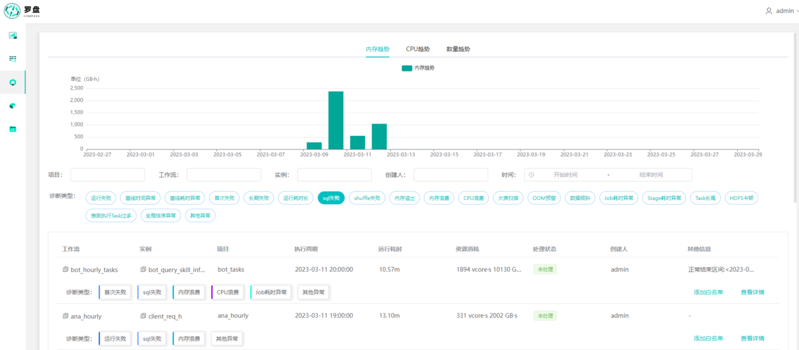

# 罗盘

[English document](README.md)

罗盘是一个大数据任务诊断平台，旨在提升用户排查问题效率，降低用户异常任务成本。

其主要功能特性如下：

- 非侵入式，即时诊断，无需修改已有的调度平台，即可体验诊断效果。
- 支持多种主流调度平台，例如DolphinScheduler、Airflow或自研等。
- 支持多版本Spark、Hadoop 2.x和3.x 任务日志诊断和解析。
- 支持工作流层异常诊断，识别各种失败和基线耗时异常问题。
- 支持引擎层异常诊断，包含数据倾斜、大表扫描、内存浪费等14种异常类型。
- 支持各种日志匹配规则编写和异常阈值调整，可自行根据实际场景优化。

罗盘已支持诊断类型概览：

<table>
    <tr>
        <td>诊断维度</td>
        <td>诊断类型</td>
        <td>类型说明</td>
    </tr>
    <tr>
        <td rowspan="3">失败分析</td>
        <td>运行失败</td>
        <td>最终运行失败的任务</td>
    </tr>
    <tr>
        <td>首次失败</td>
        <td>重试次数大于1的成功任务</td>
    </tr>
    <tr>
        <td>长期失败</td>
        <td>最近10天运行失败的任务</td>
    </tr>
    <tr>
        <td rowspan="3">耗时分析</td>
        <td>基线时间异常</td>
        <td>相对于历史正常结束时间，提前结束或晚点结束的任务</td>
    </tr>
    <tr>
        <td>基线耗时异常</td>
        <td>相对于历史正常运行时长，运行时间过长或过短的任务</td>
    </tr>
    <tr>
        <td>运行耗时长</td>
        <td>运行时间超过2小时的任务</td>
    </tr>
    <tr>
        <td rowspan="3">报错分析</td>
        <td>sql失败</td>
        <td>因sql执行问题而导致失败的任务</td>
    </tr>
    <tr>
        <td>shuffle失败</td>
        <td>因shuffle执行问题而导致失败的任务</td>
    </tr>
    <tr>
        <td>内存溢出</td>
        <td>因内存溢出问题而导致失败的任务</td>
    </tr>
    <tr>
        <td rowspan="2">成本分析</td>
        <td>内存浪费</td>
        <td>内存使用峰值与总内存占比过低的任务</td>
    </tr>
    <tr>
        <td>CPU浪费</td>
        <td>driver/executor计算时间与总CPU计算时间占比过低的任务</td>
    </tr>
    <tr>
        <td rowspan="9">效率分析</td>
        <td>大表扫描</td>
        <td>没有限制分区导致扫描行数过多的任务</td>
    </tr>
    <tr>
        <td>OOM预警</td>
        <td>广播表的累计内存与driver或executor任意一个内存占比过高的任务</td>
    </tr>
    <tr>
        <td>数据倾斜</td>
        <td>stage中存在task处理的最大数据量远大于中位数的任务</td>
    </tr>
    <tr>
        <td>Job耗时异常</td>
        <td>job空闲时间与job运行时间占比过高的任务</td>
    </tr>
    <tr>
        <td>Stage耗时异常</td>
        <td>stage空闲时间与stage运行时间占比过高的任务</td>
    </tr>
    <tr>
        <td>Task长尾</td>
        <td>stage中存在task最大运行耗时远大于中位数的任务</td>
    </tr>
    <tr>
        <td>HDFS卡顿</td>
        <td>stage中存在task处理速率过慢的任务</td>
    </tr>
    <tr>
        <td>推测执行Task过多</td>
        <td>stage中频繁出现task推测执行的任务</td>
    </tr>
    <tr>
        <td>全局排序异常</td>
        <td>全局排序导致运行耗时过长的任务</td>
    </tr>
</table>

## 如何使用

### 1. 代码编译

```shell
git clone https://github.com/cubefs/compass.git
cd compass
mvn package -DskipTests
```

### 2. 配置修改

```shell
cd dist/compass
vim bin/compass_env.sh
# Scheduler MySQL
export SCHEDULER_MYSQL_ADDRESS="ip:port"
export SCHEDULER_MYSQL_DB="scheduler"
export SCHEDULER_DATASOURCE_USERNAME="user"
export SCHEDULER_DATASOURCE_PASSWORD="pwd"
# Compass MySQL
export COMPASS_MYSQL_ADDRESS="ip:port"
export COMPASS_MYSQL_DB="compass"
export SPRING_DATASOURCE_USERNAME="user"
export SPRING_DATASOURCE_PASSWORD="pwd"
# Kafka
export SPRING_KAFKA_BOOTSTRAPSERVERS="ip1:port,ip2:port"
# Redis
export SPRING_REDIS_CLUSTER_NODES="ip1:port,ip2:port"
# Zookeeper
export SPRING_ZOOKEEPER_NODES="ip1:port,ip2:port"
# Elasticsearch
export SPRING_ELASTICSEARCH_NODES="ip1:port,ip2:port"
```

### 3. 一键部署

```
./bin/start_all.sh
```


## 文档

[架构文档](document/manual/architecture.md)

[部署指南](document/manual/deployment.md)

## 系统截图





## 版权

罗盘许可证是 [Apache License, Version 2.0](http://www.apache.org/licenses/LICENSE-2.0)，详情请参考 [LICENSE](LICENSE)
and [NOTICE](NOTICE) 。

